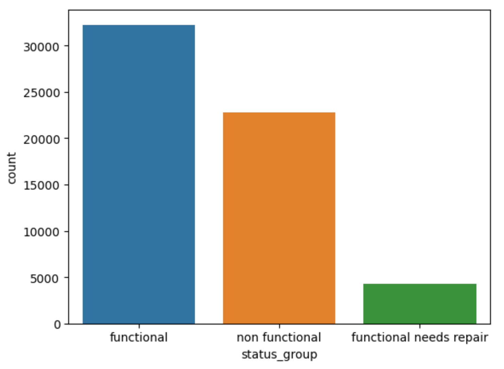
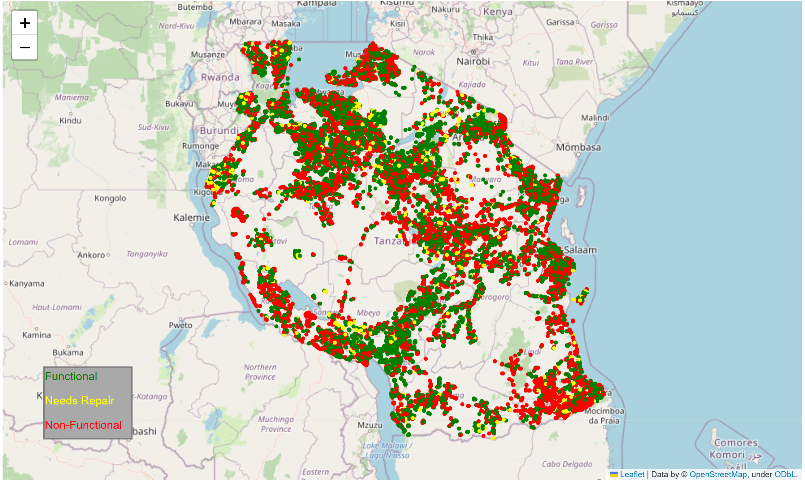
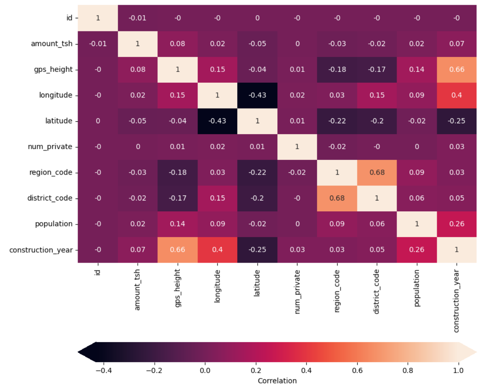
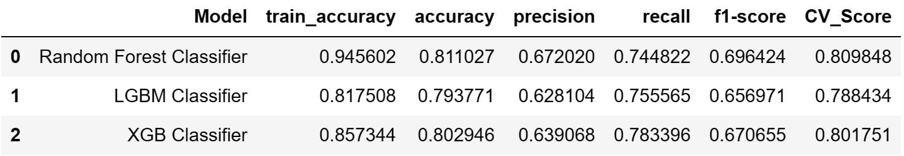
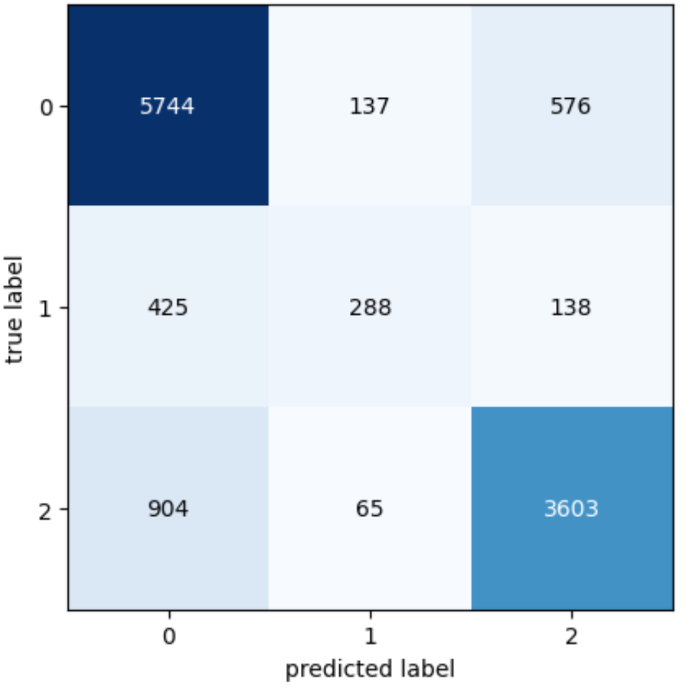
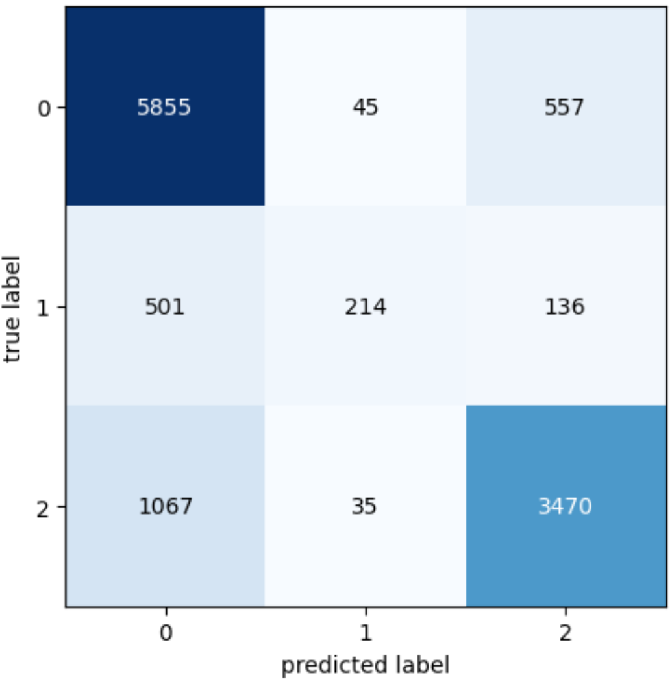

# Tanzanian-Water-Pump-prediction

 
## Project Overview 
"Data Driven Pump It Up" is a data-driven project focused on predicting the functionality of water pumps. This is a classification problem with the following categories: Functional, Not Functional, and Functional but Needs Repair.

## Aim 
The primary aim of this project is to analyze and predict the status of water pumps, leveraging various data science techniques.

## Data Exploration and Analysis 
### Exploratory Data Analysis (EDA):
 Began with basic EDA on a dataset containing nearly 60K entries.
 
### Data Insights: 
Identified unique occurrences in each column. 
 
 Found that 50% of pumps were functional, and approximately 7% were functional but needed repair. 
  

 Utilized Folium to plot a map, showcasing the status data points according to their location.

 
 
###  Data Visualization: 
Performed extensive visual analysis to compare various features such as water source, extraction type, region, water quality, and more. 

### Correlation Matrix: 
Plotted a matrix to find relationships between different features.
 

## Feature Analysis 

### Feature Selection and Cleaning: 
Conducted feature selection, identifying redundant or overlapping features like management & scheme-management, payment types, water quality, etc. 

Decided to drop features with minimal variance or high redundancy.

 Addressed missing values in coordinates by replacing them with the mean of their respective regions. 
 
 Standardized the 'Installer' column data, correcting various spelling inconsistencies. 
 
 ### Feature Engineering: 
 Created a new column for 'construction decade' derived from the 'construction year'. 

## Model Development and Evaluation 
### Predictive Models Used: 
* Random Forest Classifier 
* LGBM Classifier (Boosting) 
* XGBoost Classifier (Boosting) 

### Preprocessing: 
* Robust Scalar for scaling numerical features
* Target Encoder for encoding categorical features

Developed pipelines using sklearn for efficient preprocessing and model integration. 

### Model Selection: 

Utilized Grid Search CV for hyperparameter tuning. 

Employed Cross-validation for model validation. 

### Model Evaluation: 
Metrics used include
* Precision 
* Recall 
* Accuracy
* F1-Score 
* Confusion Matrix 

## Key Findings 
### Model Performance: 
The models' performance was assessed based on accuracy, precision, recall, F1 score, and confusion matrix outputs. 
#### Model Performance

#### Random Forest
 
#### Extreme Gradient Boosting
 
#### Light Gradient Boosting
 

Random Forest showcased significant feature importance in predictions.
### Cross-Validation:
 Conducted cross-validation to ensure the model's robustness and reliability. 
 
## Conclusion 

This project demonstrates the effective use of data science techniques in solving real-world problems, specifically in the predictive maintenance of water pumps. The insights and models developed can aid in better planning and resource allocation for water pump maintenance.
